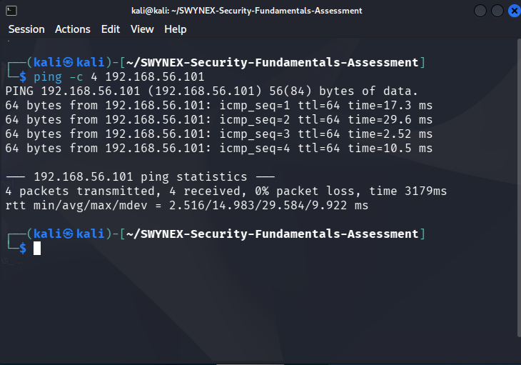
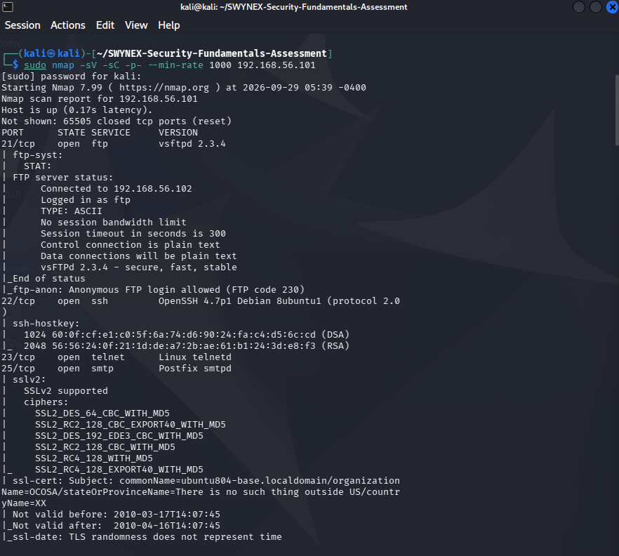
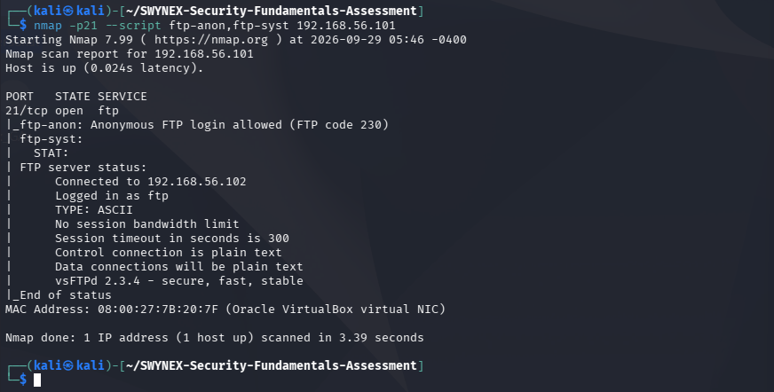
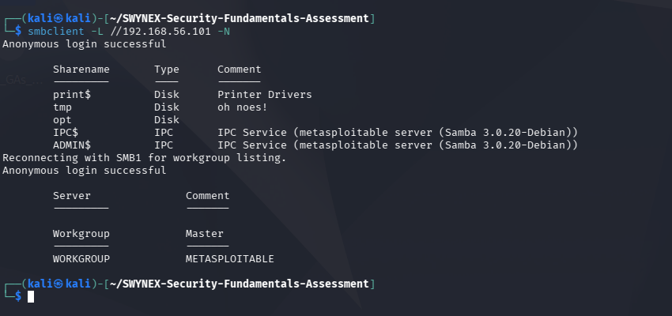
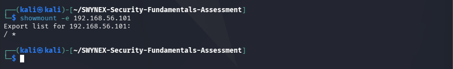
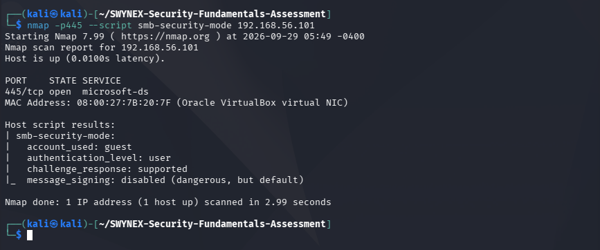

# SWYNEX Security Fundamentals Assessment

## Task 1 — Security Fundamentals Assessment

Security assessment of an intentionally vulnerable Metasploitable 2 training environment completed as part of the SWYNEX Technologies Cyber Security Internship.

## Scope

- Kali Linux: 192.168.56.102
- Metasploitable 2: 192.168.56.101
- Environment: Authorized VirtualBox training laboratory

Testing was limited to the intentionally vulnerable laboratory target.

## Assessment Workflow

**Reconnaissance → Service Enumeration → Finding Validation → Evidence Collection → Risk Documentation → Mitigation**

## Key Findings

| ID | Finding | Affected Component | Evidence |
|---|---|---|---|
| F-01 | Anonymous FTP Access | FTP / vsftpd 2.3.4 | [FTP evidence](evidence/findings/ftp-anonymous.txt) |
| F-02 | Anonymous SMB Access | SMB / Samba 3.0.20 | [SMB evidence](evidence/findings/smb-anonymous.txt) |
| F-03 | Broad NFS Export | NFS | [NFS evidence](evidence/findings/nfs-export.txt) |
| F-04 | SMB Message Signing Disabled | SMB / Samba | [SMB signing evidence](evidence/findings/smb-signing.txt) |

## Evidence Files

### Reconnaissance

- [Full TCP port and service scan](evidence/reconnaissance/full-port-scan.txt)

### Validated Findings

- [F-01 — Anonymous FTP](evidence/findings/ftp-anonymous.txt)
- [F-02 — Anonymous SMB](evidence/findings/smb-anonymous.txt)
- [F-03 — Broad NFS Export](evidence/findings/nfs-export.txt)
- [F-04 — SMB Message Signing Disabled](evidence/findings/smb-signing.txt)
- [Nmap vulnerability scan](evidence/findings/nmap-vulnerability-scan.txt)

## Visual Evidence

The following screenshots were captured directly from the authorized Kali/Metasploitable 2 laboratory session and correspond to the command-output evidence stored in this repository.

### 01 — Host Discovery

Successful connectivity to the Metasploitable 2 target at `192.168.56.101`.

### 02 — Full Port and Service Scan

Full TCP port and service enumeration of the authorized training target.

### 03 — Anonymous FTP

Validation of anonymous FTP access on port 21.

### 04 — Anonymous SMB

Validation of anonymous SMB share enumeration.

### 05 — NFS Export

NFS export enumeration showing the configured broad export.

### 06 — SMB Signing

Validation that SMB message signing is disabled.

> **Evidence integrity:** Screenshots are real captures from the authorized laboratory session and were not generated or reconstructed.

## Detailed Report

See the complete [Security Assessment Report](report/security-assessment.md) for methodology, affected components, evidence, risk discussion, and recommended mitigations.

## Learning Outcomes

This assessment provided practical experience with:

- Host discovery
- TCP port and service enumeration
- SMB and NFS enumeration
- FTP configuration validation
- Security evidence collection
- Risk identification and documentation
- Security mitigation recommendations

## Disclaimer

All testing was performed against an intentionally vulnerable training system in an authorized laboratory environment. No third-party systems were targeted.